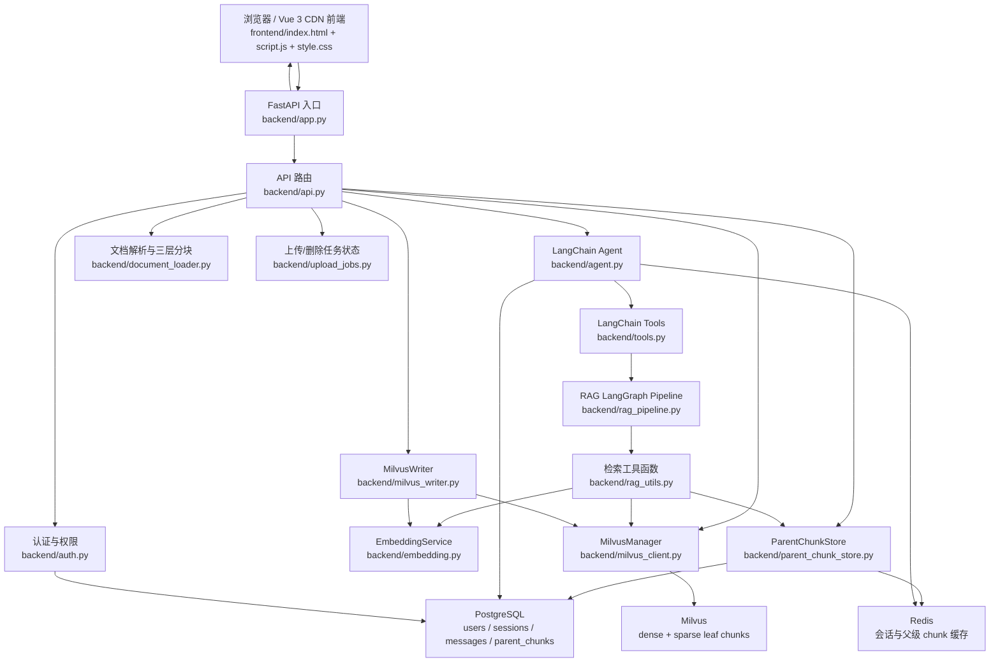
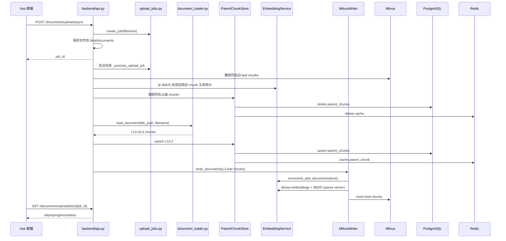
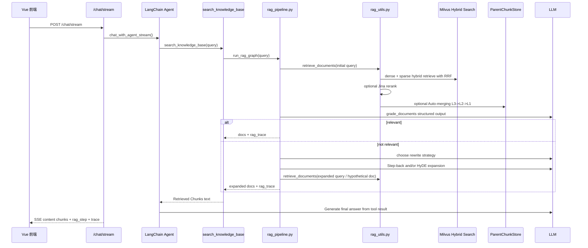
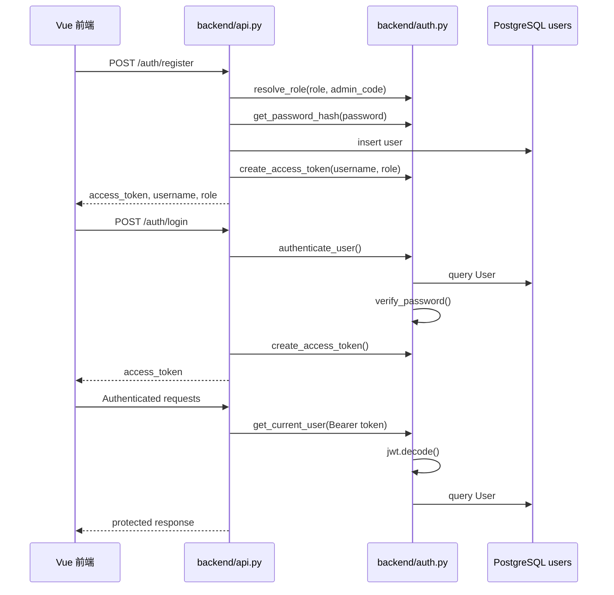

# PaperPilot-RAG 项目现状分析

本文档基于当前代码阅读生成，仅记录现有结构与改造建议，不修改业务代码。

## 1. 当前项目模块关系图

## 2. FastAPI 入口文件与 API 路由组织

FastAPI 入口在 `backend/app.py`。

- `create_app()` 创建 `FastAPI(title="PaperPilot-RAG API")`。
- 启动事件 `_startup_init_db()` 调用 `init_db()`，用 SQLAlchemy 自动创建表。
- 配置 CORS 为全开放。
- 添加开发期 no-cache middleware，避免前端 HTML/JS/CSS 缓存。
- `app.include_router(api_module.router)` 挂载 `backend/api.py` 中的 `APIRouter`。
- 如果 `frontend/` 存在，通过 `StaticFiles(..., html=True)` 将前端静态文件挂载到根路径 `/`。
- 直接执行 `python backend/app.py` 时启动 `uvicorn`。

API 路由目前集中在 `backend/api.py`，尚未拆成多个 router 文件。主要分组如下：

- 认证：`POST /auth/register`、`POST /auth/login`、`GET /auth/me`
- 会话：`GET /sessions`、`GET /sessions/{session_id}`、`DELETE /sessions/{session_id}`
- 聊天：`POST /chat`、`POST /chat/stream`
- 文档列表：`GET /documents`
- 文档上传：`POST /documents/upload`、`POST /documents/upload/async`
- 上传任务：`GET /documents/upload/jobs`、`GET /documents/upload/jobs/{job_id}`
- 文档删除：`DELETE /documents/{filename}`、`DELETE /documents/delete/async/{filename}`
- 删除任务：`GET /documents/delete/jobs/{job_id}`

## 3. 前端 Vue 3 CDN 文件位置

当前前端是 PaperPilot-RAG 的 Vue 3 CDN 单页形式：

- `frontend/index.html`：页面结构，加载 Vue 3 CDN、marked、highlight.js、Font Awesome 和 `script.js` / `style.css`。
- `frontend/script.js`：Vue `createApp`，包含认证、会话、SSE 聊天、上传、删除、文档列表、RAG Trace 展示等逻辑。
- `frontend/style.css`：页面样式。

当前前端没有 Vite、Webpack、React 或组件库，后续 PaperPilot-RAG 改造应继续沿用这个结构。

注意：当前多个中文文案在文件读取时呈现乱码，可能是文件编码或历史提交中的 mojibake 问题。后续前端改造时应优先统一修复展示文案，但本阶段不修改。

## 4. 当前文档入库流程

同步上传接口 `POST /documents/upload` 使用同一套解析、父级块存储和 Milvus 写入逻辑，但一次请求内完成全部处理；异步上传接口更适合前端展示进度。

## 5. PDF / Word / Excel 上传处理方式

文件类型判断在 `backend/api.py`：

- `_is_supported_document(filename)` 支持 `.pdf`、`.docx`、`.doc`、`.xlsx`、`.xls`。
- `upload_document_async()` 先保存文件，然后通过 FastAPI `BackgroundTasks` 调用 `_process_upload_job()`。
- `upload_document()` 是同步版本，直接在请求内完成保存、解析、分块、入库。

解析由 `backend/document_loader.py` 的 `DocumentLoader.load_document()` 完成：

- PDF：`PyPDFLoader`
- Word：`Docx2txtLoader`
- Excel：`UnstructuredExcelLoader`

解析后每个 loader 文档页/段被转换成基础元数据：

- `filename`
- `file_path`
- `file_type`
- `page_number`

随后进入 `_split_page_to_three_levels()` 做三层分块。

## 6. document_loader.py 解析和分块逻辑

`DocumentLoader` 使用 LangChain 的 `RecursiveCharacterTextSplitter` 创建三套 splitter：

- L1：较大父块，默认至少 `1200` 字符，overlap 至少 `240`
- L2：中间父块，默认至少 `600` 字符，overlap 至少 `120`
- L3：叶子检索块，默认至少 `300` 字符，overlap 至少 `60`

分块流程：

1. 按文件类型选择 loader 并 `loader.load()`。
2. 对每个页面/文档片段构造 `base_doc`。
3. 先用 L1 splitter 生成一级块。
4. 每个 L1 内再切 L2。
5. 每个 L2 内再切 L3。
6. 为每个块生成层级元数据：
   - `chunk_id = filename::p{page_number}::l{level}::{index}`
   - `parent_chunk_id`
   - `root_chunk_id`
   - `chunk_level`
   - `chunk_idx`

入库时 L1/L2 作为父级块存 PostgreSQL，L3 作为叶子块写入 Milvus。

## 7. embedding.py dense embedding 与 BM25 sparse vector

`backend/embedding.py` 定义全局单例 `embedding_service = EmbeddingService()`，API 入库和 RAG 检索共用它，保证 BM25 状态一致。

Dense embedding：

- 使用 `langchain_huggingface.HuggingFaceEmbeddings`。
- 模型来自 `EMBEDDING_MODEL`，默认 `BAAI/bge-m3`。
- 设备来自 `EMBEDDING_DEVICE`，默认 `cpu`。
- `encode_kwargs={"normalize_embeddings": True}`。
- `get_embeddings(texts)` 调用 `embed_documents`。

BM25 sparse vector：

- 本地维护词表 `_vocab`、文档频次 `_doc_freq`、总文档数 `_total_docs`、总 token 长度 `_sum_token_len`。
- 状态持久化到 `BM25_STATE_PATH`，默认 `data/bm25_state.json`。
- `tokenize()` 对中文按单字 token，对英文按连续字母 token。
- `increment_add_documents(texts)` 在写入 Milvus 前更新 BM25 统计。
- `increment_remove_documents(texts)` 在删除/覆盖同名文件前扣减 BM25 统计。
- `get_sparse_embedding(text)` 和 `get_sparse_embeddings(texts)` 根据当前 BM25 状态生成 Milvus sparse vector 字典。
- `get_all_embeddings(texts)` 同时返回 dense 和 sparse embeddings。

## 8. milvus_writer.py 写入 Milvus

`MilvusWriter.write_documents()` 负责叶子块向量化和写入：

1. 调用 `milvus_manager.init_collection()` 确保 collection 存在。
2. 提取所有文本并调用 `embedding_service.increment_add_documents(all_texts)` 更新 BM25 状态。
3. 按 `batch_size=50` 分批处理。
4. 每批调用 `embedding_service.get_all_embeddings(texts)` 生成 dense 和 sparse vectors。
5. 构造插入字段：
   - `dense_embedding`
   - `sparse_embedding`
   - `text`
   - `filename`
   - `file_type`
   - `file_path`
   - `page_number`
   - `chunk_idx`
   - `chunk_id`
   - `parent_chunk_id`
   - `root_chunk_id`
   - `chunk_level`
6. 调用 `milvus_manager.insert(insert_data)`。
7. 如果传入 `progress_callback`，每批写入后更新异步上传进度。

## 9. milvus_client.py Hybrid Search

`MilvusManager` 封装 Milvus 连接、collection schema、查询、删除和混合检索。

Collection schema：

- `id`：Milvus auto id 主键
- `dense_embedding`：`FLOAT_VECTOR`
- `sparse_embedding`：`SPARSE_FLOAT_VECTOR`
- 文本与元数据字段：`text`、`filename`、`file_type`、`file_path`、`page_number`、`chunk_idx`
- Auto-merging 字段：`chunk_id`、`parent_chunk_id`、`root_chunk_id`、`chunk_level`

索引：

- dense：`HNSW` + `IP`
- sparse：`SPARSE_INVERTED_INDEX` + `IP`

Hybrid Search 流程：

1. `hybrid_retrieve(dense_embedding, sparse_embedding, top_k, rrf_k=60, filter_expr="")`
2. 创建两个 `AnnSearchRequest`：
   - dense 搜索 `dense_embedding`
   - sparse 搜索 `sparse_embedding`
3. 每路取 `top_k * 2` 作为候选。
4. 使用 Milvus `RRFRanker(k=rrf_k)` 做 RRF Fusion。
5. `client.hybrid_search(...)` 返回融合后结果。
6. 格式化输出 chunk 文本、来源、层级 id、score。

如果 hybrid 检索失败，`rag_utils.retrieve_documents()` 会降级调用 `dense_retrieve()`。

## 10. 当前 RAG 检索问答流程

`backend/rag_pipeline.py` 使用 LangGraph `StateGraph` 定义流程：

- `retrieve_initial`
  - 调用 `retrieve_documents(question, top_k=5)`。
  - 构造初次 `rag_trace`。
  - 通过 `emit_rag_step()` 实时发送检索步骤。
- `grade_documents_node`
  - 使用 `GRADE_MODEL` 创建 grader LLM。
  - `with_structured_output(GradeDocuments)` 输出 `yes/no`。
  - yes 进入回答；no 进入问题重写。
  - 如果 grader 未配置，默认走 `rewrite_question`。
- `rewrite_question_node`
  - 使用 router model 选择 `step_back`、`hyde`、`complex`。
  - Step-back 调用 `step_back_expand()`。
  - HyDE 调用 `generate_hypothetical_document()`。
  - 更新 `rag_trace` 中的 rewrite 信息。
- `retrieve_expanded`
  - 根据 strategy 对 Step-back query 和/或 hypothetical doc 二次检索。
  - 合并去重，重排 `rrf_rank`。
  - 更新 expanded retrieval trace。

`backend/rag_utils.py` 执行检索细节：

- `retrieve_documents(query, top_k=5)`：
  - `candidate_k = max(top_k * 3, top_k)`
  - 默认只检索 `chunk_level == LEAF_RETRIEVE_LEVEL`，默认 L3。
  - 生成 dense embedding 和 BM25 sparse embedding。
  - 调用 Milvus hybrid search。
  - 调用 `_rerank_documents()` 做 Jina/API rerank，未配置则跳过。
  - 调用 `_auto_merge_documents()` 做 L3->L2->L1 自动合并。
  - hybrid 异常时降级 dense 检索。

## 11. RAG Trace 与 Citation 现状

当前系统已有 RAG Trace 数据结构，但还没有独立的正式 Citation 模型。

RAG Trace 来源：

- `rag_pipeline.py` 构造 `rag_trace`，记录：
  - tool 信息
  - query / expanded query
  - initial / expanded retrieved chunks
  - grade score / route
  - rewrite strategy
  - rerank 配置与结果
  - retrieval mode
  - candidate_k
  - leaf_retrieve_level
  - auto-merging 状态
- `tools.py` 的 `_set_last_rag_context()` 暂存最近一次 trace。
- `agent.py` 在回答结束后 `get_last_rag_context()`，把 trace 挂到 AI 消息并保存。
- `frontend/script.js` 解析 SSE `trace` 事件，并在消息下方 details 区展示。

Citation 当前可从 `retrieved_chunks` / `initial_retrieved_chunks` / `expanded_retrieved_chunks` 推导，字段包括 `filename`、`page_number`、`text`、`score`、`rrf_rank`、`rerank_score`。后续 PaperPilot-RAG 应基于这些真实 chunk 生成 Citation UI 和回答引用，不允许模型自由编造来源。

## 12. LangChain 使用位置

当前 LangChain / LangGraph 使用点：

- `backend/agent.py`
  - `init_chat_model()` 初始化聊天模型。
  - `create_agent()` 创建 Agent。
  - 使用 `HumanMessage`、`AIMessage`、`AIMessageChunk`、`SystemMessage` 管理对话消息。
  - `agent.invoke()` 用于非流式 `/chat`。
  - `agent.astream(stream_mode="messages")` 用于 `/chat/stream`。
- `backend/tools.py`
  - `@tool("search_knowledge_base")` 定义知识库搜索工具。
  - `get_current_weather` 当前被作为普通函数传入 tools，未加 `@tool` 装饰，但 LangChain 可能根据函数签名包装。
- `backend/rag_pipeline.py`
  - `init_chat_model()` 初始化 grader/router LLM。
  - `with_structured_output()` 用 Pydantic schema 约束相关性评分和改写策略。
  - `StateGraph` 定义 RAG 状态图。
- `backend/rag_utils.py`
  - `init_chat_model()` 用于 Step-back 和 HyDE 生成。
- `backend/document_loader.py`
  - `PyPDFLoader`、`Docx2txtLoader`、`UnstructuredExcelLoader`
  - `RecursiveCharacterTextSplitter`
- `backend/embedding.py`
  - `HuggingFaceEmbeddings`

## 13. tools.py 中的 LangChain tools

`backend/tools.py` 当前包含：

- `search_knowledge_base(query: str) -> str`
  - 使用 `@tool("search_knowledge_base")` 注册为 LangChain tool。
  - 每轮对话最多允许调用一次，通过 `_KNOWLEDGE_TOOL_CALLS_THIS_TURN` 限制。
  - 内部调用 `run_rag_graph(query)`。
  - 将 `rag_trace` 放入 `_LAST_RAG_CONTEXT`。
  - 返回格式化的 retrieved chunks 给 Agent。
- `get_current_weather(location, extensions="base") -> str`
  - 查询高德天气 API。
  - 被 `agent.py` 放入 `tools=[get_current_weather, search_knowledge_base]`。
  - 依赖 `AMAP_WEATHER_API` 和 `AMAP_API_KEY`。
- RAG step 支持函数：
  - `set_rag_step_queue(queue)`
  - `emit_rag_step(icon, label, detail="")`
  - `get_last_rag_context(clear=True)`
  - `reset_tool_call_guards()`

## 14. agent.py 如何调用 LangChain Agent

`backend/agent.py` 初始化全局 `agent, model = create_agent_instance()`。

Agent 配置：

- 模型来自 `.env`：
  - `ARK_API_KEY`
  - `MODEL`
  - `BASE_URL`
- `init_chat_model(..., model_provider="openai", temperature=0.3, stream_usage=True)`
- `create_agent()` tools：
  - `get_current_weather`
  - `search_knowledge_base`
- system prompt 要求：
  - 文档/知识问题使用 `search_knowledge_base`
  - 每轮最多一次知识库工具调用
  - 拿到检索结果后立即生成最终回答
  - 不要编造不足的上下文

非流式：

- `chat_with_agent()`
- 从 `ConversationStorage` 加载历史消息。
- 清理上轮 RAG context 和工具调用计数。
- 超过 50 条历史时调用 `summarize_old_messages()` 压缩旧消息。
- `agent.invoke(...)` 得到最终回答。
- 保存 human + ai 消息，AI 消息附带 `rag_trace`。

流式：

- `chat_with_agent_stream()`
- 使用 `asyncio.Queue` 汇聚 `content`、`rag_step`、`error`。
- `set_rag_step_queue(_RagStepProxy())` 让同步 RAG tool 可以向主事件循环发送实时步骤。
- 后台 `_agent_worker()` 调用 `agent.astream(stream_mode="messages")`。
- 主循环持续从 queue 取事件并 yield SSE。
- Agent 完成后再发送 `trace` 事件和 `[DONE]`。
- 最后保存完整回复和 `rag_trace`。

## 15. /chat/stream SSE 流式输出

入口在 `backend/api.py` 的 `chat_stream_endpoint()`：

- 接收 `ChatRequest`。
- 依赖 `get_current_user`，必须携带 Bearer Token。
- 内部定义 `event_generator()`。
- 调用 `chat_with_agent_stream(message, username, session_id)`。
- 将每个 chunk 原样 yield 给前端。
- 异常时 yield：
  - `data: {"type": "error", "content": "..."}\n\n`
- 返回 `StreamingResponse`：
  - `media_type="text/event-stream"`
  - `Cache-Control: no-cache, no-store, must-revalidate`
  - `Connection: keep-alive`
  - `X-Accel-Buffering: no`

前端 `frontend/script.js` 没有使用 `EventSource`，而是用 `fetch('/chat/stream') + ReadableStream.getReader()`：

- 手动按 `\n\n` 拆 SSE event。
- 处理 `data.type === "content"` 追加消息文本。
- 处理 `data.type === "rag_step"` 展示实时 RAG 步骤。
- 处理 `data.type === "trace"` 保存 `ragTrace`。
- 处理 `data.type === "error"` 展示错误。
- 使用 `AbortController` 支持停止生成。

## 16. 当前登录认证流程

`backend/auth.py` 认证细节：

- JWT：
  - `JWT_SECRET_KEY` 默认是 `change-this-secret`，生产必须通过 `.env` 设置强随机值。
  - `JWT_ALGORITHM` 默认 `HS256`。
  - `JWT_EXPIRE_MINUTES` 默认 `1440`。
- 密码：
  - 新密码使用 PBKDF2-SHA256。
  - 兼容历史 bcrypt/passlib hash。
- 权限：
  - `get_current_user()` 校验 Bearer Token 并加载用户。
  - `require_admin()` 要求 `current_user.role == "admin"`。
  - `resolve_role()` 只有 `ADMIN_INVITE_CODE` 匹配时才允许注册 admin。

权限影响：

- `/chat`、`/chat/stream`、`/sessions*`：登录用户可用。
- `/documents`、上传、删除、任务查询：当前都依赖 `require_admin`，仅管理员可用。
- 前端也用 `isAdmin` 控制设置/文档管理入口显示，但真正安全边界在后端依赖。

## 17. PostgreSQL、Redis、Milvus 分工

PostgreSQL：

- `users`：账号、密码 hash、角色。
- `chat_sessions`：用户会话元信息。
- `chat_messages`：消息内容、时间戳、AI 消息上的 `rag_trace`。
- `parent_chunks`：L1/L2 父级 chunk，用于 Auto-merging 拉取更大上下文。

Redis：

- 会话消息缓存：`chat_messages:{user_id}:{session_id}`
- 会话列表缓存：`chat_sessions:{user_id}`
- 父级 chunk 缓存：`parent_chunk:{chunk_id}`
- Redis 不可用时 cache wrapper 捕获异常，系统回退 PostgreSQL。

Milvus：

- 存储 L3 叶子 chunk。
- 同时保存 dense vector 和 BM25 sparse vector。
- 执行 hybrid search + RRF fusion。
- 保存检索所需文本、文件来源、页码、chunk 层级关系。

本地文件：

- 上传原文件保存到 `data/documents/`。
- BM25 持久化状态默认保存到 `data/bm25_state.json`。

进程内存：

- `upload_jobs.py` 当前把上传/删除任务状态保存在进程内 dict；服务重启后任务状态会丢失。
- `tools.py` 用进程内全局变量保存单轮工具调用 guard、最近 RAG context、RAG step queue。

## 18. PaperPilot-RAG 可以复用的模块

建议优先复用：

- `backend/app.py`
  - FastAPI 启动、CORS、静态前端挂载方式可继续沿用。
- `backend/auth.py`
  - JWT + RBAC 基础能力可复用。
- `backend/database.py` / `backend/models.py`
  - 用户、会话、消息、父级 chunk 模型可继续作为基础数据层。
- `backend/cache.py`
  - Redis JSON cache wrapper 简洁，可继续使用。
- `backend/document_loader.py`
  - PDF / Word / Excel 基础解析和三层分块可作为第一版论文/项目文档入库基础。
- `backend/embedding.py`
  - dense + BM25 sparse 单例状态对 hybrid retrieval 很关键，应复用。
- `backend/milvus_client.py`
  - Milvus hybrid search、RRF fusion、dense fallback 是核心能力。
- `backend/milvus_writer.py`
  - leaf-only 写入与批量进度回调可复用。
- `backend/parent_chunk_store.py`
  - Auto-merging 所需父级块存储可复用。
- `backend/rag_utils.py` / `backend/rag_pipeline.py`
  - 现有初检、相关性判断、重写、二检、rerank、auto-merge、trace 链路可作为 PaperPilot-RAG 的核心基础。
- `backend/agent.py` / `backend/tools.py`
  - Agent + tool 调用框架可复用，但 system prompt 和 tools 后续需要面向科研论文改造。
- `frontend/index.html` / `frontend/script.js` / `frontend/style.css`
  - Vue 3 CDN 结构和 SSE 读取方式可复用，后续可继续拆分 PaperPilot-RAG UI。

## 19. 后续改造时不建议轻易修改的模块

不建议一开始大改：

- `embedding.py`
  - BM25 状态与 sparse vector 维度依赖 Milvus 中已有数据；随意改 token/vocab 逻辑可能导致旧 sparse vectors 与新词表不一致。
- `milvus_client.py` schema
  - 改 collection schema 通常需要迁移或重建 Milvus collection，风险高。
- `milvus_writer.py` 的写入字段
  - 与 schema、检索 trace、前端展示强相关。
- `document_loader.py` 的 `chunk_id` / `parent_chunk_id` / `root_chunk_id`
  - Auto-merging 依赖这些关系。
- `parent_chunk_store.py`
  - Auto-merging 的父级块读取依赖 PostgreSQL/Redis 双层逻辑。
- `rag_utils.retrieve_documents()`
  - Hybrid Search、BM25、RRF、Jina Rerank、Auto-merging 都集中在这里，是核心 RAG 能力。
- `rag_pipeline.py` 的状态字段和 `rag_trace` 字段
  - 前端 trace 展示、聊天历史保存、后续 citation 都会依赖。
- `/chat/stream` 与 `chat_with_agent_stream()`
  - 当前 SSE + RAG step 实时输出链路已经打通，重构容易破坏流式体验。
- `auth.py` 的 `get_current_user` / `require_admin`
  - 影响所有受保护接口。

可以逐步调整但要小步走：

- `api.py`
  - 当前路由较集中，后续可以按 auth/chat/documents/evaluation 拆分，但每次只迁移一个边界。
- `frontend/script.js`
  - 目前函数较多且中文乱码，应逐步模块化注释和重命名，不建议一次性重写所有交互。
- `agent.py` system prompt 和工具列表
  - 可以逐步加入 PaperPilot 专用 tools，例如论文比较、审稿分析、项目文档问答。

## 20. 建议的后续修改顺序

1. 基础品牌与文案清理
   - 将历史项目文案替换为 PaperPilot-RAG。
   - 修复前端和后端用户可见中文乱码。
   - 保持 Vue 3 CDN 和现有文件结构。

2. 前端结构整理
   - 在 `frontend/script.js` 中按要求划分注释区块：API 请求封装、state、文件上传、SSE、文档列表、Citation、RAG Trace、错误/loading。
   - 先不改接口协议，只改善可维护性和页面标题。

3. Citation 展示第一版
   - 基于现有 `rag_trace.retrieved_chunks` 渲染 Citations 区域。
   - Citation 只来自真实检索 chunk，显示 filename/page/excerpt/rerank_score/rrf_rank。

4. Paper Library 改造
   - 在不改入库核心链路的前提下，把文档列表 UI 改成 Paper Library。
   - 后续再考虑增加论文元数据字段，如 title/authors/year/venue/tags。

5. RAG Trace 面板改造
   - 将当前 details 中的 trace 信息整理为独立的 RAG Trace 区域。
   - 保留 initial retrieval、expanded retrieval、rerank、auto-merge 信息。

6. 后端路由轻拆分
   - 在功能稳定后，把 `api.py` 按领域拆分为 `routes/auth.py`、`routes/chat.py`、`routes/documents.py` 等。
   - 迁移时保持路径和响应 schema 不变。

7. 论文/项目文档增强解析
   - 在 `document_loader.py` 外新增模块处理论文元数据、章节结构、参考文献、表格/图注。
   - 不直接破坏当前三层分块和 chunk id 规则。

8. Agentic RAG tools 扩展
   - 新增论文比较、审稿分析、项目文档问答、评价报告等 StructuredTool。
   - 保持 `search_knowledge_base` 作为核心检索工具。

9. 评估体系
   - 新增 Evaluation Report 后端接口与前端面板。
   - 对 dense/sparse/hybrid/rerank/auto-merge 做可复现实验记录。

10. 任务状态持久化
    - 将 `upload_jobs.py` 的进程内状态迁移到 Redis 或 PostgreSQL。
    - 支持服务重启恢复和多进程部署。

## 21. 当前风险与注意事项

- 多个中文字符串显示为乱码，可能影响前端验收和错误信息可读性。
- `api.py` 和 `frontend/script.js` 已经偏大，继续加功能前最好先局部整理。
- `.env.example` 中部分变量示例格式带注释占位，实际 `.env` 必须确保值正确。
- `JWT_SECRET_KEY` 默认值不安全，生产部署必须替换。
- BM25 状态与 Milvus sparse vectors 强耦合，删除/覆盖流程必须继续先同步 BM25 再删除/写入。
- 上传/删除 job 状态为进程内存，服务重启会丢任务进度。
- `get_current_weather` 目前未显式 `@tool` 装饰，后续升级 LangChain 版本时需验证兼容性。
- `main.py` 只是打印 LangChain 版本，不是应用入口。
